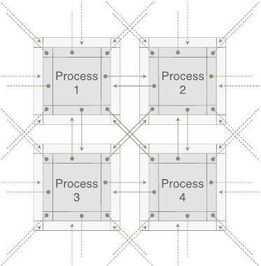
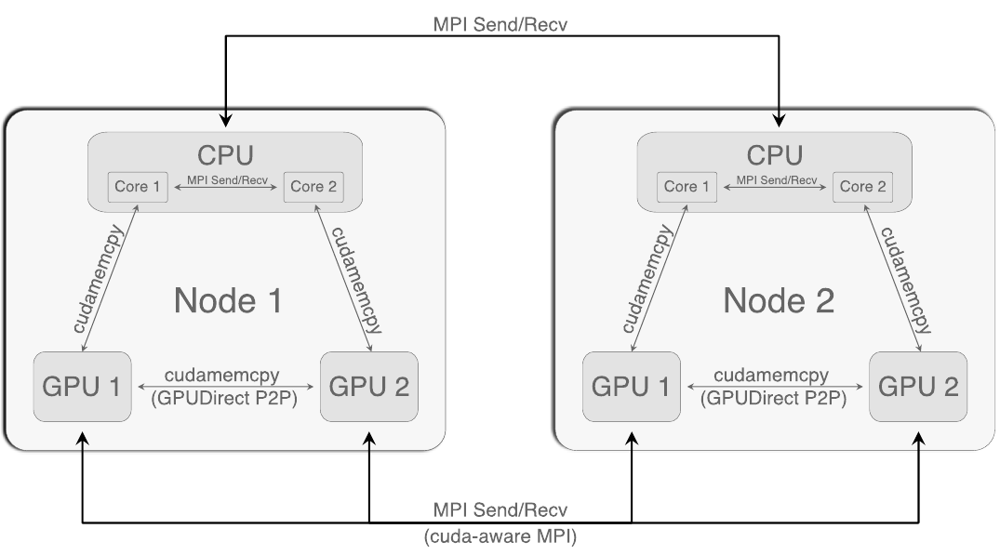

# Communication

All classes related to communication can be found in
```shell
src/base/communication
```

To work with multiple devices, SIMULATeQCD splits a lattice into multiple
sublattices, with partitioning possible along any
space-time direction. Each sublattice is given to a single GPU, and we
call this sublattice the bulk.
In addition, the GPU holds a copy of the outermost borders of neighboring
sublattices, which we call the halo. This halo is necessary because many
measurement and update processes are stencil operations, which means that a
calculation performed at some site may need information from a neighboring
sublattice. Every so often, information from all sublattices must be injected
into their neighbors' halos. A schematic drawing of the exchange 
of halo information between different GPUs is shown below.



## CommunicationBase

Communication between multiple CPUs and multiple nodes is handled with MPI, which also 
allows for communication between multiple GPUs. 
We use MPI two-sided communication.
For NVIDIA hardware, we handle communication between GPUs on the same node using CUDA
GPUDirect P2P. CUDA-aware MPI is used for internode communication.
We boost performance by allowing the code to
carry out certain computations while communicating, such as copying halo buffers
into the bulk, whenever possible.
An example of what different 
communication channels might be available for two nodes is given below.

Wrappers for methods used in these various communication libraries are collected in
the `CommunicationBase` class. The `CommunicationBase` will also detect whether
CUDA-aware MPI or GPUDirect P2P are available, and if they are, use them 
automatically since these channels have less communication overhead than standard MPI,
and are hence much faster.



## HaloOffsetInfo and neighborInfo

Halo communication proceeds by first copying halo information contiguously into a buffer.
This requires translating from the sublattice's indexing scheme to the buffer's indexing
scheme; the difference between these schemes is called the halo offset, 
computed by `haloOffsetInfo` class.
This class provides offsets for different halo segments 
(stripe halo, corner halo, etc). These offsets and the buffer 
base pointer are used to place the halo data at the correct position in the buffer. 
An example for the corner halo would be:

$
\text{corner buffer pointer} = \text{buffer base pointer} +
                                   \text{corner halo offset}.
$

In order to communicate, each sublattice needs to know something about his neighbors,
for example their rank or whether they are on the same node. This information is
kept in the `neighborInfo` class.

## siteComm

The `siteComm` class is the highest level class from which all objects that need to
communicate across sublattices, such as the [Gaugefield](gaugefield.md#gaugefield)
inherit. It uses the [Memorymanagement](../02_contributions/memoryAllocation.md) 
to allocate memory for the buffer,
uses the `haloOffsetInfo` to translate the local index to the buffer index,
copies information into the buffer, and finally uses the `CommunicateBase` to
carry out the exchange.
